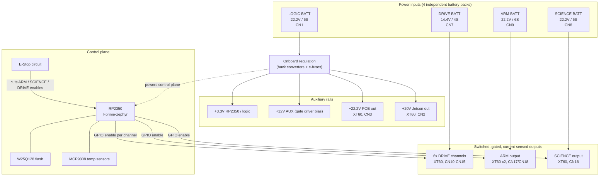
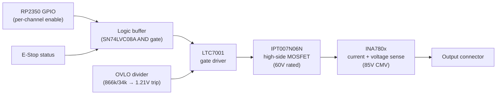

    # BILLEE — Rover Control Module (Power Distribution Board)

BILLEE is a Mars-rover-style rover platform built as a university project. This repository holds the hardware for the **Rover Control Module (RCM)** — the rover's central power distribution and control board. It takes in power from up to four independent battery packs, gates and protects eight switched high-current outputs (six drivetrain channels plus dedicated ARM and SCIENCE subsystem outputs), and hosts the RP2350 microcontroller that supervises the whole board, running [NASA JPL's F´ (F Prime)](https://fprime.jpl.nasa.gov/) flight software framework on Zephyr RTOS.

## Table of contents

- [System overview](#system-overview)
- [Power architecture](#power-architecture)
- [Per-channel protection chain](#per-channel-protection-chain)
- [Subsystems](#subsystems)
- [Connectors](#connectors)
- [Repository layout](#repository-layout)
- [Getting started](#getting-started)
- [Design status](#design-status)
- [Contributors](#contributors)

## System overview



## Power architecture

Every high-current output is switched, not just fused — each channel has its own MOSFET high-side switch, gate driver, and current/voltage sense IC, controlled by the RP2350 and independently protected against overvoltage.

| Input | Voltage | Pack | Connector | Feeds |
|---|---|---|---|---|
| LOGIC | 22.2V nominal | 6S | CN1 (XT90) | Onboard regulation → 3.3V logic, 12V gate-driver bias, POE out, Jetson out |
| DRIVE | 14.4V nominal | 4S | CN7 (XT90) | 6x independently gated drivetrain outputs |
| ARM | 22.2V nominal | 6S | CN9 (XT90) | ARM actuator output (dedicated, not shared with LOGIC) |
| SCIENCE | 22.2V nominal | 6S | CN8 (XT90) | SCIENCE payload output (dedicated, not shared with LOGIC) |

ARM and SCIENCE each have their own battery input rather than sharing the LOGIC bus — this keeps their (higher-current, motor-driven) load switching electrically isolated from the board's own logic supply.

## Per-channel protection chain

The same signal chain protects all eight switched outputs (six DRIVE channels, ARM, SCIENCE) — this is what sits between the RP2350's enable GPIO and the actual output connector:



Each channel's overvoltage lockout trips at roughly the same ~32V threshold regardless of that channel's nominal rail — set by a fixed 866kΩ/34kΩ divider into the gate driver's 1.21V comparator reference. The MOSFETs and current-sense amplifiers were selected with wide margin above every rail on this board (60V and 85V ratings against a top end around 25V), so the same switch/sense stage is reused across the 14.4V DRIVE channels and the 22.2V ARM/SCIENCE channels without modification.

## Subsystems

| Subsystem | Sheet | What's there |
|---|---|---|
| RP2350A | `mcurp2350.kicad_sch` | RP2350 MCU, crystal, QSPI flash, USB-C, SWD debug header, GPIO breakout |
| Logic Subsystem | `power.kicad_sch` | Buck regulators, e-fuses, logic/auxiliary rail generation |
| Subsystem Power Control | `estop.kicad_sch` | E-stop circuit, all 8 gate-driver/switch/sense channels, OVLO dividers |

## Connectors

| Ref | Part | Count | Purpose |
|---|---|---|---|
| CN1 | XT90PW | 1 | LOGIC battery input (22.2V) |
| CN7 | XT90PW | 1 | DRIVE battery input (14.4V) |
| CN8 | XT90PW | 1 | SCIENCE battery input (22.2V) |
| CN9 | XT90PW | 1 | ARM battery input (22.2V) |
| CN10–CN15 | XT60PW | 6 | DRIVE channel outputs 1–6 |
| CN16 | XT60PW | 1 | SCIENCE output |
| CN17, CN18 | XT60PW | 2 | ARM output |
| CN2 | XT60PW | 1 | Jetson power output (+20V) |
| CN3 | XT60PW | 1 | POE output (+22.2V) |
| CN4, CN5 | XT60PW | 2 | Auxiliary +12V outputs |
| CN6 | DF11-18DP | 1 | RP2350 GPIO breakout (9 GPIO + ADC0/1 + power/GND) |
| USB1 | USB-C | 1 | RP2350 USB |
| J1 | 2.54mm header | 1 | SWD debug (SWCLK/SWD/GND) |

## Repository layout

```
billee-hardware-2027/
├── BILLEE_Rover_Control_Module_V1/       # KiCad project for the RCM board (this board)
│   ├── BILLEE_Rover_Control_Module_V1.kicad_sch   # top-level schematic
│   ├── mcurp2350.kicad_sch                        # RP2350A sheet
│   ├── power.kicad_sch                            # Logic Subsystem sheet
│   ├── estop.kicad_sch                            # Subsystem Power Control sheet
│   ├── BILLEE_Rover_Control_Module_V1.kicad_pcb    # PCB layout
│   ├── BILLEE_RCM.step                             # 3D STEP export
│   ├── PDB_Engineering_Requirements_and_Design_Guide_Rev_H.docx
│   ├── lib/                              # custom KiCad symbol/footprint libraries
│   ├── sims/                             # LTspice simulations per subsystem
│   └── jlcpcb/                           # fab outputs
│       ├── gerber/                       # Gerber + drill files
│       └── production_files/             # BOM, CPL, packaged GERBER.zip for JLCPCB
├── BILLEE_Science_Control_Module_V1/     # separate KiCad project (early stage)
├── fprime-billee-rcm/                    # F´ component library for this board (git submodule)
└── arduino-billee-scm/                   # Arduino sketch for the Science Control Module
```

## Getting started

1. Clone with submodules — the F´ component library is a separate repo:
   ```
   git clone --recurse-submodules https://github.com/BroncoSpace-BILLEE/billee-hardware-2027.git
   ```
2. Open `BILLEE_Rover_Control_Module_V1/BILLEE_Rover_Control_Module_V1.kicad_pro` in KiCad. The custom library footprints under `lib/` are wired up via the project's `fp-lib-table`/`sym-lib-table` — no extra setup needed.
3. To order the board: everything JLCPCB needs is pre-generated in `BILLEE_Rover_Control_Module_V1/jlcpcb/production_files/` — `BOM-*.csv`, `CPL-*.csv`, and `GERBER-*.zip`. If you change the design, regenerate these (via the KiCad JLCPCB/Fabrication-Toolkit plugin) before ordering — the production files are a separate export step from the schematic/PCB and don't update automatically.
4. Firmware for the RCM runs [F´](https://fprime.jpl.nasa.gov/) on Zephyr; the board-specific F´ components live in the `fprime-billee-rcm` submodule.

## Design status

This board has been through multiple engineering review passes covering bare-fabrication geometry (clearances, hole spacing, via annular ring, zone integrity, board outline), full-board net connectivity, BOM/CPL/Gerber consistency against the actual sourced parts, and datasheet-checked voltage/current margin on every switched-power component. As of the current `main`, it's been reviewed and cleared to order.

## Contributors

- Luca Lanzi ([@LucaLanzi](https://github.com/LucaLanzi))
- Jason Suarez ([@Plush-Jason](https://github.com/Plush-Jason))